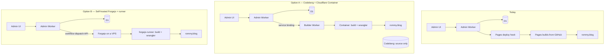

# Migrating rommy.blog from GitHub to Forgejo

Moving the repo's source of truth to [Forgejo](https://forgejo.org) — either hosted on [Codeberg](https://codeberg.org) or self-hosted — and replacing the GitHub-dependent deploy pipeline, so publishing from the admin UI still rebuilds the site automatically.

Companion to [`ORIGIN-MIGRATION.md`](ORIGIN-MIGRATION.md), which analysed the same move to Cursor Origin. Where the two overlap, this document says so rather than repeating the work. **It also corrects one constraint that document got wrong** — see [section 1.3](#13-the-constraint-and-a-correction).

> **Status — 2026-08-28.** No migration has happened. What *has* happened is the low-cost first step this document recommends in [section 10](#verdict): a Codeberg repo exists at `codeberg.org/fingerguns/blog` and `origin` carries two push URLs, so every `git push` reaches GitHub and Codeberg. GitHub remains the source of truth, the only fetch remote, and the forge all CI and tooling still points at. Everything below is unexecuted.

---

## 1. Context

### 1.1 What is actually coupled to GitHub

Re-audited against the current tree, not inherited from the Origin document. Two entries are new since it was written.

| # | Coupling | Location |
|---|---|---|
| 1 | The git remote | `https://github.com/fingerguns/blog.git` |
| 2 | Three Actions workflows | `.github/workflows/{build,d1-execute,deploy-worker}.yml` |
| 3 | Pages project `rommy-blog` builds on push to `main` | Cloudflare dashboard, build command `node build-pages.mjs` |
| 4 | `triggerRebuild()` — deploy hook, with a GitHub `workflow_dispatch` fallback | `worker/update-thinking.js:619-647` |
| 5 | Worker vars `GITHUB_OWNER` / `GITHUB_REPO` / `GITHUB_BRANCH`, secret `GITHUB_TOKEN` | `worker/wrangler.toml:11-13,58` |
| 6 | Changelog entries link to `github.com/.../commit/{hash}` | `scripts/build.mjs:1770` |
| 7 | Footer "GitHub" link, rendered with `rel="me"` | `scripts/d1-client.mjs:235` |
| 8 | Colophon links: "repo", and "MIT licensed" → GitHub-hosted `LICENSE` | `colophon/index.html:29,44` |
| 9 | **NEW —** the docs drift sweep routine clones `github.com/fingerguns/blog` | Cloud routine `trig_01RGunVKiR5vRmb56tVDoWjA` |
| 10 | **NEW —** day-to-day `gh` CLI use, and `/code-review ultra <PR#>` | Local workflow, not the repo |

Items 9 and 10 did not exist when the Origin document was written and are the ones most likely to be overlooked. See [section 7](#7-what-breaks-that-the-origin-plan-never-had-to-consider).

### 1.2 What is not coupled to GitHub

Unchanged from the Origin analysis, and still the reason this is low-risk:

Content lives in **Cloudflare D1** — Writing, Thinking, Reading, Sharing, section hints, Oura data. Media lives in **R2**. `dist/` is gitignored and generated HTML is never committed. The Worker makes no GitHub Contents API calls; it only *triggers* rebuilds. `.claude/hooks/docs-guard.sh` shells out to plain `git` and is forge-agnostic.

**Changing git hosts touches source and CI. It never touches your writing.**

### 1.3 The constraint, and a correction

Cloudflare Pages git integration supports **GitHub and GitLab only**, and explicitly not self-hosted instances of either — so not Forgejo, not Gitea. That much the Origin document had right, and it is why deploy hooks die with GitHub.

But it drew the wrong conclusion from it. The Cloudflare docs state the lock-in runs the *other* way:

> If you choose Direct Upload, you cannot switch to Git integration later.
> For existing Git-integrated projects, you can manually create deployments using Wrangler.

**A git-connected Pages project accepts `wrangler pages deploy` alongside its git builds.** That matters enormously:

- No new Pages project. No moving the `rommy.blog` custom domain. No DNS cutover, no downtime window.
- No Cloudflare Container builder is *required*. The Origin document's entire Phase 2 — a container Worker, a Dockerfile, a `server.mjs`, ~200 lines of new infrastructure — exists to solve a problem that `wrangler pages deploy dist` already solves from any CI runner.

The real question for a Forgejo migration is therefore not "how do we build?" but **"where does the runner live?"**

### 1.4 The actual crux: who runs the CI

Forgejo ships [Forgejo Actions](https://forgejo.org/docs/latest/user/actions/), a GitHub-Actions-shaped CI. But **Forgejo does not host runners for you.** You register your own `forgejo-runner`, and "if a job specifies a label for which no runner is online, the job cannot be executed."

On Codeberg specifically: hosted Forgejo Actions exists in **limited open alpha**, with tighter resource and time constraints than their Woodpecker CI, [held back by security and bus-factor concerns](https://codeberg.org/Codeberg/Community/issues/1702). Codeberg's own documentation frames Actions as [self-hosted runners connected to Codeberg](https://docs.codeberg.org/ci/actions/); their reviewed, form-gated [Woodpecker instance](https://docs.codeberg.org/ci/) is the mature hosted path.

Your laptop cannot be that runner — the whole point of the current pipeline is that publishing a Thinking note from your phone rebuilds the site while the laptop is shut. That single requirement drives the entire choice below.

### 1.5 Two coherent end-states



**Option A — Codeberg for source, Cloudflare Container for CI.** Forgejo is your forge; CI is not Forgejo Actions. You inherit the Origin document's Phase 2 wholesale (it is already written), and Codeberg gives you free public browsing and an offsite copy of history. Nothing new to operate.

**Option B — Self-host Forgejo plus a runner on one small VPS.** A true GitHub replacement: Actions, issues, PRs, releases, and CI all in one place, with your three existing workflows ported nearly as-is. You now own uptime for your own deploy path.

### 1.6 Why Forgejo beats Origin on the thing that matters here

The Origin migration was forced into building a container builder because Origin has no CI of its own and its repos are Internal/Private only. Forgejo has both CI and public visibility. Concretely:

- `triggerRebuild()`'s GitHub fallback becomes the **primary** path, and it is a near-drop-in swap. Forgejo exposes [`POST /repos/{owner}/{repo}/actions/workflows/{workflow}/dispatches`](https://forgejo.org/docs/latest/user/actions/reference/) with typed inputs — the same endpoint shape the Worker already speaks. Roughly ten lines change: host, and `Authorization: Bearer` → `token`.
- Public source browsing works out of the box, so the colophon's "repo" and "MIT licensed" links stay live instead of being unlinked.
- The changelog's commit links keep working against a Forgejo commit URL.

---

## 2. Choosing the host

| | **A. Codeberg** | **B. Self-hosted Forgejo** |
|---|---|---|
| Cost | Free (donation-funded non-profit) | ~$5–12/mo VPS + backups |
| You operate | Nothing | Forgejo, runner, TLS, upgrades, backups |
| CI | Container builder (Origin Phase 2) or bring-your-own runner | Forgejo Actions, native |
| Public browsing | Yes | Yes, if you expose it |
| Offsite copy of history | Yes — third location, outside Cloudflare | No — it is *your* box; needs its own backup |
| Failure mode | Codeberg outage blocks pushes, not the site | Your VPS dies; deploys stop until you fix it |
| Migration effort | Moderate (container builder) | Higher up front, simpler steady state |

**Recommendation: A, with B as the upgrade path.** Codeberg costs nothing, adds a genuinely independent copy of your history, and asks you to run no servers. The container builder is already designed in the Origin document and is the smaller of the two unknowns. Move to B only if you find yourself wanting issues, PR review, and Actions in one place — and note that B *removes* the offsite-redundancy benefit unless you keep Codeberg as a mirror anyway.

A hybrid is legitimate and probably the honest end-state: **self-host or Codeberg for source, Cloudflare Container for deploys, Codeberg mirror for redundancy.**

---

## 3. Prerequisites

Shared with the Origin plan — [section 2](ORIGIN-MIGRATION.md) there covers the Cloudflare token in detail. In short:

1. **A Cloudflare API token** with `Cloudflare Pages / Edit`, `Workers Scripts / Edit`, `D1 / Edit`, and (for Phase 6 backups) `R2 / Edit`. Account ID `1df3451668c8de1e33dfac434da4ee97`.
2. **A `deploy` npm script, which does not currently exist.** The Origin document refers to `npm run deploy` as though it does; `package.json` has no such script. Add before starting:

   ```json
   "deploy": "npm run build && npx wrangler pages deploy dist --project-name=rommy-blog",
   "deploy:worker": "cd worker && npx wrangler deploy"
   ```

   **Prove `npm run deploy` works while GitHub is still connected.** It is the escape hatch for every later phase, and it is also the thing that confirms section 1.3's correction is true for your account before you rely on it.
3. **A Forgejo account and empty repo** — Codeberg sign-up, or a provisioned VPS running Forgejo.
4. **`gitleaks` clean over full history** *before* any public mirror exists. A hard gate, not a nicety — and it has already earned that description here.

   **Run 2026-08-28, before the Codeberg mirror was populated: not clean.** A Giphy API key committed in `40dbb02` and reverted the same day in `641350e` was still present in history and still authenticating five weeks later, in a repo that was already public. It was revoked before the mirror was pushed; history was deliberately left unrewritten, since rewriting would break every changelog commit link from that point on and un-publish nothing.

   Two lessons this leaves for anyone re-running this plan. Deleting a secret from `HEAD` is not remediation — **revoke at the provider, then verify the old value is dead.** And confirm a revocation with a cache-busted request against a known-bad control: the first three post-revocation checks here returned HTTP 200 from a cached `trending` response and looked like a failed revocation that had in fact succeeded.

   The repo now carries `.githooks/pre-commit` (`gitleaks git --staged`) so the next one is blocked at commit time rather than found five weeks later. It scans staged changes only, so this full-history scan is still the gate before any *new* mirror.

---

## 4. Phase 1 — Move the repo

```bash
# Keep GitHub reachable during the transition; add Forgejo as the new origin.
git remote rename origin github
git remote add origin https://codeberg.org/fingerguns/blog.git
git push -u origin --all
git push origin --tags
```

Verify nothing was lost before touching anything else:

```bash
git rev-list --count HEAD          # compare against GitHub's commit count
git log --oneline -5               # same five commits, same hashes
git ls-remote --heads origin       # main present
```

Hashes must match exactly. A rewritten hash means the changelog's commit links — and the `git log` the changelog is generated from — would silently diverge.

**Do not delete the GitHub repo in this phase.** It is your rollback for everything that follows, and item 9 in the coupling table still depends on it.

### 4.1 If you are mirroring rather than migrating

The dual-push setup from [section 10](#verdict) is already in place and is the state this repo is actually in:

```bash
git remote set-url --add --push origin https://github.com/fingerguns/blog.git
git remote set-url --add --push origin https://codeberg.org/fingerguns/blog.git
```

Two operational notes that cost an hour to discover:

- **Authentication cannot be completed from inside an agent session.** Nothing there has a TTY, so `git push` fails with `could not read Username ... Device not configured` rather than prompting. Worse, if `GIT_ASKPASS` points at an editor helper whose process has exited (Cursor's `vscode-git-*.sock`), git delegates to it, gets `ECONNREFUSED`, and gives up *without* falling back to a prompt. Authenticate once in a real terminal, or use an SSH key; afterwards `osxkeychain` answers silently and agent-driven pushes work.
- **The mirror is write-only.** `git fetch` still goes to GitHub alone. Correct for redundancy, wrong the moment you treat Codeberg as a second source of truth. Note also that a failed Codeberg leg makes `git push` report failure *after* GitHub has already accepted the commit — the push errored, but the commit is safely on GitHub.

---

## 5. Phase 2 — CI

### 5.1 Option A: reuse the Origin container builder

Follow [`ORIGIN-MIGRATION.md` sections 4.2–4.6](ORIGIN-MIGRATION.md) verbatim. Nothing in that design is Origin-specific — the container clones a git URL, runs `node scripts/build.mjs`, and uploads with Wrangler. Point its clone URL at Forgejo.

Two simplifications now available:

- The `git fetch --unshallow` dance in `build-pages.mjs` exists because Pages clones at depth 1. A container you control can clone at full depth and skip it.
- Because a git-connected Pages project accepts Wrangler deploys ([section 1.3](#13-the-constraint-and-a-correction)), you can build the container against the *existing* project and roll back by simply re-enabling automatic deployments.

### 5.2 Option B: port the workflows to Forgejo Actions

Workflows move from `.github/workflows/` to **`.forgejo/workflows/`**. Compatibility is partial by design — Forgejo's own docs warn that "GitHub Actions and Forgejo Actions *are not the same* and things might not work right away" — so treat these as ports, not copies.

Three specific hazards in your three workflows:

1. **`cloudflare/wrangler-action@v3` is a GitHub-hosted action.** Forgejo resolves bare action names against its configured source, which may or may not proxy GitHub. Replace it with a plain `npx wrangler` call — fewer moving parts and no cross-forge fetch:

   ```yaml
   - run: npx wrangler deploy
     working-directory: worker
     env:
       CLOUDFLARE_API_TOKEN: ${{ secrets.CLOUDFLARE_API_TOKEN }}
       CLOUDFLARE_ACCOUNT_ID: ${{ secrets.CLOUDFLARE_ACCOUNT_ID }}
   ```

2. **`workflow_dispatch` with typed inputs** (used by `d1-execute.yml`) is supported in current Forgejo, including via API. Verify on your instance's version before relying on it.
3. **`runs-on: ubuntu-latest`** means nothing until a runner registers a matching label. Register the runner with the labels your workflows name, or rewrite `runs-on` to match the runner.

A new `deploy-site.yml` replaces what Pages' git integration did:

```yaml
name: Build and deploy site
on:
  push:
    branches: [main]
  workflow_dispatch:

jobs:
  deploy:
    runs-on: docker
    steps:
      - uses: actions/checkout@v4
        with:
          fetch-depth: 0        # changelog needs full history — replaces the unshallow hack
      - run: npm ci
      - run: node scripts/build.mjs
        env:
          CF_ACCOUNT_ID: ${{ secrets.CF_ACCOUNT_ID }}
          CF_API_TOKEN: ${{ secrets.CF_API_TOKEN }}
          CF_D1_DATABASE_ID: ${{ secrets.CF_D1_DATABASE_ID }}
      - run: npx wrangler pages deploy dist --project-name=rommy-blog
        env:
          CLOUDFLARE_API_TOKEN: ${{ secrets.CLOUDFLARE_API_TOKEN }}
          CLOUDFLARE_ACCOUNT_ID: ${{ secrets.CLOUDFLARE_ACCOUNT_ID }}
```

Note `node scripts/build.mjs` directly rather than `build-pages.mjs` — with `fetch-depth: 0` the unshallow wrapper is dead weight.

---

## 6. Phase 3 — Rewire the pipeline

### 6.1 Cloudflare Pages

Disable automatic branch deployments on `rommy-blog`. Leave the project git-connected (harmless, and it preserves rollback); it simply stops building on its own. Delete the deploy hook only after [Phase 5](#8-phase-5--verification) passes.

### 6.2 The admin Worker

`triggerRebuild()` at `worker/update-thinking.js:619-647` currently tries `PAGES_DEPLOY_HOOK`, then falls back to GitHub `workflow_dispatch`. After migration the hook is dead and the fallback becomes the only path.

**Option A:** replace both with a service binding to the builder Worker — Origin document section 5.2, unchanged.

**Option B:** repoint the existing fallback. The endpoint shape is nearly identical:

```js
// was: https://api.github.com/repos/${owner}/${repo}/actions/workflows/build.yml/dispatches
//      Authorization: `Bearer ${env.GITHUB_TOKEN}`,  Accept: application/vnd.github+json
`https://codeberg.org/api/v1/repos/${owner}/${repo}/actions/workflows/deploy-site.yml/dispatches`
// Authorization: `token ${env.FORGEJO_TOKEN}`
```

Rename `GITHUB_*` vars to `FORGEJO_*` in `worker/wrangler.toml:11-13` and mint the token with repo-scoped write access only. Keep the `job_runs` recording that wraps it — the Health tab is how you will find out this broke.

### 6.3 Retire the workflows

Delete `.github/workflows/` once the replacements are proven. `build.yml` (manual rebuild) is superseded by whatever triggers the new pipeline; `deploy-worker.yml` and `d1-execute.yml` need ports or manual equivalents (`npm run deploy:worker`, `wrangler d1 execute`).

---

## 7. What breaks that the Origin plan never had to consider

**The docs drift sweep stops working. This is tested, not assumed.** Routine `trig_01RGunVKiR5vRmb56tVDoWjA` clones `https://github.com/fingerguns/blog`. On 2026-08-28 a one-shot probe routine was pointed at `https://codeberg.org/fingerguns/blog`: the API **accepted** it at creation, then the runner logged `Cloning repository fingerguns/blog` — host discarded — and failed with `Check that your GitHub token or credentials have read access`. The Codeberg repo is public and needs no credentials, so the source URL is being resolved as a GitHub `owner/repo` regardless of the host supplied.

So after a migration the sweep has two options, neither free: keep a GitHub mirror purely to feed it — which means not actually leaving GitHub — or move it to a Forgejo Actions scheduled workflow, viable only under Option B and only with a runner awake on Mondays. Re-run the probe before migrating; this is the item most likely to have changed.

**`gh` CLI and `/code-review ultra <PR#>` are GitHub-only.** Day-to-day review flow changes; `gh pr view` has no Forgejo equivalent in this setup. Forgejo has a REST API and a `tea` CLI, but the Claude Code integrations do not speak them. The local `docs-guard.sh` hook is unaffected — it only shells out to plain `git`.

**The `rel="me"` identity chain.** `scripts/d1-client.mjs:235` renders a GitHub profile link with `rel="me"`, making GitHub an IndieAuth identity. If you ever signed in to webmention.io through it, removing the account can lock you out of the service that receives Writing comments. **Verify webmention.io sign-in through Bluesky, Mastodon, or micro.blog before deleting anything on GitHub** — not after. This is the single most dangerous step in the migration and it has nothing to do with git.

---

## 8. Phase 5 — Verification

Run in order; each isolates a different failure.

1. `npm run build && npm run preview` — local build unaffected by the remote change.
2. `/changelog/` is populated in the preview — proves full history came across.
3. `npm run deploy` — the escape hatch works, and section 1.3 holds for your account.
4. CI builds on demand (container `/build`, or the Forgejo workflow triggered from the UI).
5. Worker triggers CI: publish a test Thinking note from the admin, confirm `rommy.blog` updates unattended within a couple of minutes. **This is the one that matters** — it is the whole reason the pipeline exists.
6. The admin **Health** tab shows the rebuild job green after step 5. If `triggerRebuild()` is silently failing, this is where it surfaces.
7. `gitleaks detect --log-opts="--all"` clean, *before* the mirror is public.
8. Drift-sweep routine either still runs or has a documented replacement.

### Rollback

Cheap until you delete the GitHub repo: `git remote set-url origin https://github.com/fingerguns/blog.git`, re-enable automatic Pages deployments, restore `PAGES_DEPLOY_HOOK`, revert `triggerRebuild()`. Retire GitHub only after step 5 has passed on several real posts.

---

## 9. Phase 6 — What GitHub was doing besides hosting git

[Section 8 of the Origin document](ORIGIN-MIGRATION.md) covers this in full and applies almost unchanged: D1 export to R2, `git bundle` to R2, gitleaks, and the note that three dependencies (`aws4fetch`, `ffmpeg-static`, `markdownlint-cli2`) do not justify replacing Dependabot.

Two differences under Forgejo:

- **Public source browsing is solved by the forge itself**, so the colophon links stay live and the changelog keeps linking commits. That was the Origin plan's most awkward compromise and it simply disappears here.
- **Issues come with the forge.** The Origin document proposed an Obsidian vault because Origin has no tracker. Forgejo has one. Use it or don't, but you are not forced to improvise.

The concentration problem the Origin document raised is *better* under Option A: Codeberg is a genuinely independent organisation holding a full copy of history, outside both Cloudflare and Microsoft. Under Option B, self-hosting, it is *worse* — your VPS is one more thing you own and must back up.

---

## 10. Pros and cons

### For

- **Independence from Microsoft**, on infrastructure run by a non-profit or by you. For a personal blog whose colophon is an argument about how the site is built, this is a coherent position rather than a technicality.
- **AGPL, self-hostable software.** The exit from Forgejo is `git clone`; the exit from GitHub is this document.
- **Codeberg is a third, independent copy of history** — outside the Cloudflare concentration this stack already has. That makes the move a genuine de-risking, not a lateral one.
- **CI portability improves.** Porting to Forgejo Actions forces the removal of `cloudflare/wrangler-action` in favour of `npx wrangler`, which runs anywhere. The pipeline gets *less* forge-specific in the process.
- **The `build-pages.mjs` unshallow hack dies**, replaced by `fetch-depth: 0`.
- **The Pages custom domain never moves** — no DNS cutover, no downtime, thanks to [section 1.3](#13-the-constraint-and-a-correction).
- **Cheaper and simpler than the Origin plan**, which needed a container builder purely to work around a constraint that turned out not to exist.

### Against

- **You lose hosted CI.** This is the real cost. GitHub Actions runs unattended and free; Forgejo hands you a runner to operate, or Codeberg gives you a limited alpha. The container-builder workaround is ~200 lines of infrastructure you now maintain.
- **The drift sweep may not survive** ([section 7](#7-what-breaks-that-the-origin-plan-never-had-to-consider)), along with `gh` and `/code-review ultra`. Tooling you use daily is GitHub-shaped.
- **Discoverability drops to roughly zero.** Realistically irrelevant for a personal blog nobody forks — but it is the honest entry on this side of the ledger.
- **Codeberg is donation-funded and volunteer-run.** Excellent stewardship, a fraction of GitHub's resources. Their Actions caution is a symptom of exactly that.
- **Self-hosting means you own uptime for your own deploy path.** A VPS that dies at the wrong moment means you cannot publish.
- **`rel="me"` identity risk** — recoverable, but a genuine way to lock yourself out of webmention.io if sequenced carelessly.
- **Effort against benefit.** The pipeline works today. Everything here is elective.

### Verdict

**If the goal is leaving GitHub, Forgejo on Codeberg is a better destination than Cursor Origin** — cheaper, more independent, public browsing intact, issues included, and it keeps a copy of history outside Cloudflare. The Origin plan's container builder was designed around a constraint that does not exist, and this migration inherits the design without inheriting the necessity.

**But nothing here is urgent, and one thing argues for waiting:** the tooling built this week — the drift sweep, the `gh`-based review flow — is GitHub-shaped, and item 9 is untested. The cheap experiment was a **push mirror**, and it is now done: Codeberg is a second push URL, GitHub stays the CI-and-tooling forge, and the open question is whether over a month Codeberg becomes where you actually go to read your own code.

The first `--add --push` replaces the implicit default, so **both** lines are required — listing only Codeberg would silently stop pushing to GitHub. See [section 4.1](#41-if-you-are-mirroring-rather-than-migrating) for the commands and the authentication caveats. That buys the offsite-redundancy benefit — the most valuable item on the "for" list — for a few minutes of work and no migration at all.

---

## Appendix — Cost

| | Option A (Codeberg) | Option B (self-hosted) |
|---|---|---|
| Forge | $0 | $5–12/mo VPS |
| CI | Cloudflare Containers, within the Workers Paid plan you already have — ~1,000 builds/month before overage (Origin Appendix A) | Runner on the same VPS, $0 marginal |
| Backups | R2, pennies | R2, pennies — plus you must back up the forge itself |
| **Total** | **~$0/mo** | **~$5–12/mo** |

Neither is meaningfully expensive. The cost of this migration is attention, not money.

---

## Sources

- [Cloudflare Pages git integration](https://developers.cloudflare.com/pages/configuration/git-integration/) — GitHub/GitLab only, no self-hosted instances
- [Cloudflare Pages Direct Upload](https://developers.cloudflare.com/pages/get-started/direct-upload/) — git-integrated projects can deploy via Wrangler; the lock-in runs Direct-Upload → git
- [Forgejo Actions user guide](https://forgejo.org/docs/latest/user/actions/) — partial GitHub compatibility, `.forgejo/workflows/`, bring-your-own runner
- [Forgejo Actions reference](https://forgejo.org/docs/latest/user/actions/reference/) — `workflow_dispatch` API endpoint and typed inputs
- [Codeberg CI documentation](https://docs.codeberg.org/ci/) and [Forgejo Actions on Codeberg](https://docs.codeberg.org/ci/actions/)
- [Codeberg-hosted Forgejo Actions discussion](https://codeberg.org/Codeberg/Community/issues/1702) — limited alpha, security and bus-factor constraints
