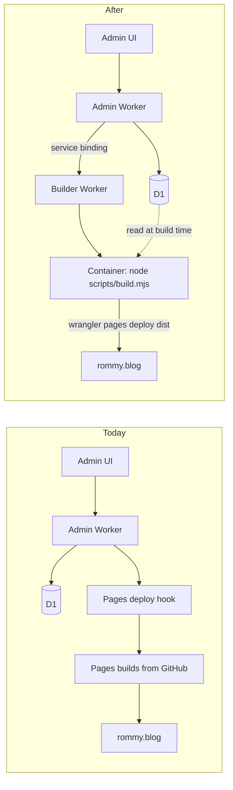
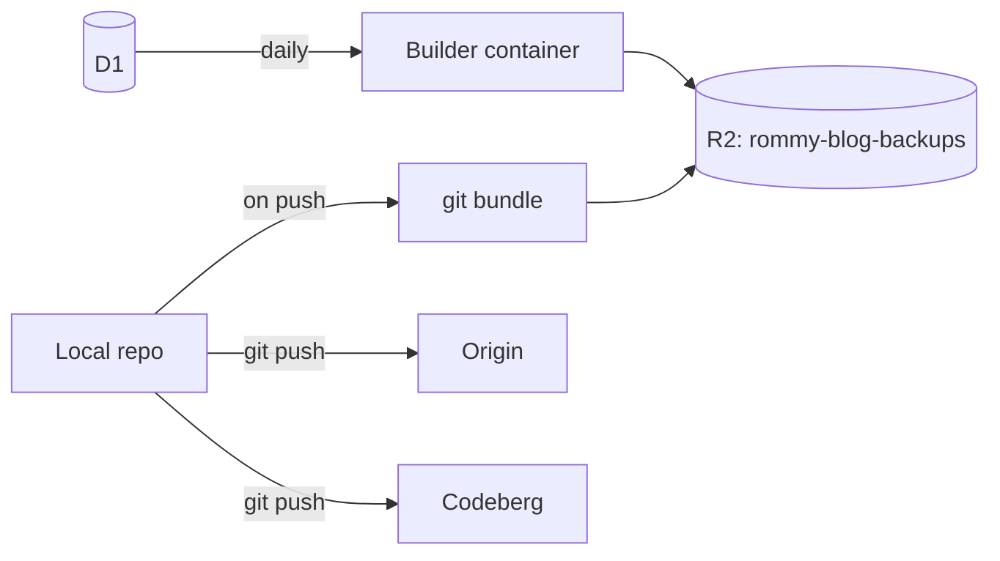

# Migrating rommy.blog from GitHub to Cursor Origin

Moving the repo's source of truth to [Cursor Origin](https://cursor.com/codebase/fingerguns/blog) and replacing the GitHub-dependent deploy pipeline with a Cloudflare Container builder, so publishing from the admin UI still rebuilds the site automatically.

---

## 1. Context

### What is actually coupled to GitHub

Five things, and only one of them is the git remote:

- The git remote itself, `https://github.com/fingerguns/blog.git`
- Three GitHub Actions workflows in `.github/workflows/`
- The Cloudflare Pages project `rommy-blog`, which builds on push to `main`
- The admin Worker's `triggerRebuild()`, which posts to a Pages deploy hook and falls back to a GitHub `workflow_dispatch`
- Public-facing references and identity — repo and profile links rendered into the live site, one of them carrying `rel="me"`. Covered in [section 8.1](#81-three-references-phase-4-missed)

Separately, GitHub is doing three jobs nothing in Phases 1–5 replaces: offsite backup of history, public source browsing, and secret scanning. See [Phase 6](#8-phase-6--closing-the-remaining-github-dependencies).

### What is not coupled to GitHub

Content. Writing posts, Thinking notes, Reading, Sharing, section hints, and Oura data all live in **Cloudflare D1**. Media lives in **R2**. `dist/` is gitignored and generated HTML is never committed. The Worker has no GitHub Contents API calls anywhere — it only *triggers* rebuilds.

This is what makes the migration low-risk: changing git hosts touches source code and CI, never your writing.

### The constraint

Cloudflare Pages git integration supports GitHub and GitLab only. Deploy hooks exist only on git-connected projects. So `PAGES_DEPLOY_HOOK -> Pages builds from GitHub` is genuinely dead once GitHub is gone.

Cloudflare's *managed* builder is not the only option, though. A Cloudflare Container running Node and Wrangler can run the same build and upload to the same Pages project.

### Architecture



### Why a container rather than porting the build into the Worker

`scripts/build.mjs` imports `node:child_process` at line 6 to shell out to `git log` for the changelog, and `node:fs` at line 7 to write the `dist/` tree. A container reuses all 2,235 lines untouched. Porting into a Worker means rewriting both and replacing the output path with the Pages Direct Upload API. The container is the low-risk path.

### Options that were ruled out

- **CircleCI** — supports GitHub, GitLab, and Bitbucket only. No arbitrary git remotes.
- **Cloudflare Workers Builds** — same GitHub/GitLab restriction as Pages.
- **Netlify, Vercel, Render** — all require a supported forge.
- **Origin webhooks for push-triggered builds** — possible, but needs an Origin App, Ed25519 signature verification, and a runtime clone token. Deferred; see [Appendix B](#appendix-b--deferred-origin-webhooks).

Not ruled out, but not chosen as the steady state:

- **Cursor Automations** — genuinely viable and far less to build. Worth using as the first proof the pipeline works. See [section 4.7](#47-alternative-cursor-automations).

---

## 2. Prerequisites

### A Cloudflare token that can deploy

Your current `CF_API_TOKEN` is exported in your shell, so Wrangler picks it up automatically, but it currently fails against Pages:

```text
✘ [ERROR] A request to the Cloudflare API (/accounts/1df3451668c8de1e33dfac434da4ee97/pages/projects) failed.
  Authentication error [code: 10000]
```

Add these permissions to the token (or mint a new one):

- `Account / Cloudflare Pages / Edit`
- `Account / Workers Scripts / Edit`
- `Account / D1 / Edit`

Account ID is `1df3451668c8de1e33dfac434da4ee97`.

### Docker running locally

`wrangler deploy` builds and pushes the container image using Docker, so Docker Desktop or Colima must be running whenever you deploy the builder. Verify with `docker info`.

### The Origin CLI

```bash
curl -fsSL https://downloads.cursor.com/origin/install.sh | sh
origin --version
origin auth login
```

The binary lands at `~/.local/bin/origin`; add it to `PATH` if your shell cannot find it. Signing in also installs the git credential helper, so `git push` and `git pull` against Origin remotes work with no further setup.

### Housekeeping

`data/spotify-thumbnails.json` is currently modified in your working tree — a build cache artifact. Commit or discard it before switching remotes.

---

## 3. Phase 1 — Move the repo to Origin

### 3.1 Detach from GitHub (browser)

In Origin, open the repo **Settings → General → Danger Zone** and select **Detach from GitHub**.

This matters. Until you detach, the Origin repo is a *mirror*: pushes pass straight through to GitHub, and GitHub stays the source of truth. Detaching converts the Origin copy into a standalone repository. Your GitHub repository is not affected.

### 3.2 Repoint the remote

```bash
git remote set-url origin https://origin.cursor.com/fingerguns/blog.git
git remote -v
```

### 3.3 Verify nothing was lost

```bash
git fetch origin
git branch -r          # expect main + the 17 cursor/* branches
git log --oneline -5   # history intact, HEAD at 6414e2c or later
```

Do not delete or archive the GitHub repo until Phase 5 passes. It is your rollback.

---

## 4. Phase 2 — Build the container builder

### 4.1 Fix the changelog first

`scripts/build.mjs` lines 807–824 derive the changelog by shelling out to git, and swallow any failure:

```807:824:scripts/build.mjs
// Changelog from git log
let changelogEntries = [];
try {
  const raw = execSync(
    'git log --pretty=format:"%H|||%ad|||%s" --date=format:"%Y-%m-%d"',
    { cwd: root, encoding: "utf8", env: { ...process.env, TZ: "America/New_York" } }
  );
```

Inside a container with no `.git`, that `catch` blanks the changelog page silently rather than erroring. Fix it by baking the changelog into the image.

Add `scripts/gen-changelog.mjs`, which writes the same shape `build.mjs` expects:

```js
import { execSync } from "node:child_process";
import { writeFileSync } from "node:fs";

const raw = execSync(
  'git log --pretty=format:"%H|||%ad|||%s" --date=format:"%Y-%m-%d"',
  { encoding: "utf8", env: { ...process.env, TZ: "America/New_York" } }
);

const entries = raw
  .trim()
  .split("\n")
  .filter(Boolean)
  .map((line) => {
    const parts = line.split("|||");
    return { hash: parts[0], date: parts[1], message: parts.slice(2).join("|||") };
  });

writeFileSync("data/changelog.json", JSON.stringify(entries, null, 2));
```

Then change the `build.mjs` block to prefer the file and fall back to git for local builds:

```js
let changelogEntries = [];
const changelogPath = join(root, "data/changelog.json");
if (existsSync(changelogPath)) {
  changelogEntries = JSON.parse(readFileSync(changelogPath, "utf8"));
} else {
  try {
    // existing execSync git log block
  } catch (e) {
    changelogEntries = [];
  }
}
```

`data/changelog.json` should be gitignored — it is a build artifact regenerated on every builder deploy.

### 4.2 Directory layout

```text
builder/
  wrangler.toml
  index.js        Worker: routes to the container
  Dockerfile
  server.mjs      runs inside the container
.dockerignore     at repo root
```

### 4.3 `builder/wrangler.toml`

```toml
name = "rommy-blog-builder"
main = "index.js"
compatibility_date = "2026-07-10"
workers_dev = false          # reachable only via service binding

[[containers]]
class_name = "Builder"
image = "./Dockerfile"
image_build_context = ".."   # repo root, so COPY can see the whole tree
instance_type = "basic"
max_instances = 1            # serialize builds; never race two deploys

[[durable_objects.bindings]]
name = "BUILDER"
class_name = "Builder"

[[migrations]]
tag = "v1"
new_sqlite_classes = ["Builder"]

[vars]
PAGES_PROJECT = "rommy-blog"

# wrangler secret put CF_ACCOUNT_ID
# wrangler secret put CF_API_TOKEN
# wrangler secret put CF_D1_DATABASE_ID
```

`image_build_context` is resolved relative to the config file and defaults to the Dockerfile's own directory, which is why it must be set explicitly to `..` here.

The Durable Object must use `new_sqlite_classes`, not `new_classes`.

### 4.4 `builder/index.js`

```js
import { Container, getContainer } from "@cloudflare/containers";

export class Builder extends Container {
  defaultPort = 8080;
  sleepAfter = "15m"; // long enough that a build never gets napped mid-flight

  constructor(ctx, env) {
    super(ctx, env);
    this.envVars = {
      // read by scripts/build.mjs via scripts/d1-client.mjs
      CF_ACCOUNT_ID: env.CF_ACCOUNT_ID,
      CF_API_TOKEN: env.CF_API_TOKEN,
      CF_D1_DATABASE_ID: env.CF_D1_DATABASE_ID,
      // read by wrangler pages deploy
      CLOUDFLARE_ACCOUNT_ID: env.CF_ACCOUNT_ID,
      CLOUDFLARE_API_TOKEN: env.CF_API_TOKEN,
      PAGES_PROJECT: env.PAGES_PROJECT,
    };
  }
}

export default {
  async fetch(request, env) {
    const { pathname } = new URL(request.url);
    const container = getContainer(env.BUILDER, "singleton");

    if (pathname === "/build" && request.method === "POST") {
      return container.fetch(new Request("http://container/build", { method: "POST" }));
    }
    if (pathname === "/status") {
      return container.fetch(new Request("http://container/status"));
    }
    return new Response("Not found", { status: 404 });
  },
};
```

A fixed `"singleton"` id means every request lands on the same container instance, which combined with `max_instances = 1` guarantees builds are serialized.

### 4.5 `builder/Dockerfile`

`scripts/build.mjs` imports only Node builtins and local `./lib/*` modules — the colophon's "no runtime dependencies" claim holds — so the image needs no `npm ci` for the site build. It only needs Wrangler for the deploy step.

```dockerfile
FROM node:22-slim

WORKDIR /app

# Pin to the same major you run locally; check with: npx wrangler --version
RUN npm install -g wrangler@4

COPY . .

EXPOSE 8080
CMD ["node", "builder/server.mjs"]
```

`.dockerignore` at the repo root:

```text
node_modules
worker/node_modules
dist
.git
.env
.wrangler
remark42
```

### 4.6 `builder/server.mjs`

Returns `202` immediately and builds in the background, so saving a post in the admin never waits on a deploy.

```js
import { createServer } from "node:http";
import { execFile } from "node:child_process";
import { promisify } from "node:util";

const run = promisify(execFile);

let building = false;
let last = { state: "idle" };

async function build() {
  if (building) {
    last = { ...last, queued: true };
    return;
  }
  building = true;
  const startedAt = new Date().toISOString();
  try {
    await run("node", ["scripts/build.mjs"], { cwd: "/app" });
    await run(
      "wrangler",
      ["pages", "deploy", "dist", `--project-name=${process.env.PAGES_PROJECT}`, "--branch=main"],
      { cwd: "/app" }
    );
    last = { state: "ok", startedAt, finishedAt: new Date().toISOString() };
  } catch (err) {
    last = { state: "failed", startedAt, error: String(err.stderr || err) };
    console.error("build failed", last.error);
  } finally {
    building = false;
  }
}

createServer((req, res) => {
  if (req.method === "POST" && req.url === "/build") {
    build();
    res.writeHead(202).end("accepted");
    return;
  }
  if (req.url === "/status") {
    res.writeHead(200, { "content-type": "application/json" });
    res.end(JSON.stringify({ building, last }));
    return;
  }
  res.writeHead(404).end();
}).listen(8080);
```

Build caches no longer touch the container's disk. They moved to the D1 `build_cache` table (`scripts/lib/build-cache.mjs`) precisely because ephemeral-disk writes were being discarded — in Pages that already meant every build refetched anything added since those files were last committed, and the container would have inherited the same problem in a worse form, with the cache frozen at image-build time. The container reads and writes the cache over the same D1 HTTP API it already uses for content, so a sleeping container costs nothing.

### 4.7 Alternative: Cursor Automations

[Cursor Automations](https://cursor.com/docs/cloud-agent/automations) can run the build instead of a container, and doing so deletes almost all of Phase 2 — no Dockerfile, no builder Worker, no Durable Object, no service binding.

Origin supports this directly. Per the [Origin integrations docs](https://cursor.com/docs/origin/integrations): *"Automations run cloud agents on a schedule or when source-control events fire. Point an automation at an Origin repository the same way you would at a connected GitHub or GitLab repo."* When a trigger fires, Cursor starts a sandbox with a fresh clone at HEAD where the agent can install dependencies and run terminal commands.

**Two triggers, covering both cases:**

- **Webhook** — the important one. Publishing a post writes to D1 and never touches git, so no source-control trigger can see it. A webhook trigger gives you a URL and auth token after saving, and `triggerRebuild()` posts to it exactly as it posts to the Pages deploy hook today.
- **Push to branch** — covers source changes to `main`, replacing the `npm run deploy:builder` step.

The automation's instructions need to be tight and mechanical, something close to: *run `npm run build`, then `wrangler pages deploy dist --project-name=rommy-blog --branch=main`, change no files, and report the command output verbatim.* Secrets (`CF_ACCOUNT_ID`, `CF_API_TOKEN`, `CF_D1_DATABASE_ID`) go in the cloud agent environment.

**Why the container is still the steady-state answer:**

- **An LLM sits in the deploy path.** An automation runs a cloud agent, not a deterministic CI job. The correct behavior here is "run these two commands, unchanged, every time." An agent may instead fix an error it notices, skip a step, or report success it did not verify. Tight instructions make that unlikely, not impossible.
- **Secrets leave Cloudflare.** The build needs a token with Pages Edit, which can deploy to rommy.blog. In the container design that token never leaves Cloudflare. Here it lives in a Cursor cloud environment readable by an agent.
- **Slower, and billed per publish.** Sandbox start plus clone plus build is likely minutes against the container's seconds, and each run consumes agent compute.

**Recommended sequencing if this migration goes ahead:** stand up the automation first as a cheap end-to-end proof that D1 to build to Pages works without GitHub, then replace it with the container once the pipeline is trusted.

One caveat worth remembering: Automations already support GitHub, so this capability is not a reason to move to Origin. It only becomes *necessary* after the migration removes the Pages git build.

---

## 5. Phase 3 — Rewire the pipeline

### 5.1 Cloudflare Pages (browser)

1. Open the `rommy-blog` project → **Build** → edit **Branch control** → turn off automatic production branch deployments.
2. Delete the deploy hook.

Deleting the hook matters. Left alive, a hook-triggered build would rebuild from the now-frozen GitHub source and silently overwrite whatever the container deployed.

Keep the existing project rather than making a new one. Cloudflare does not let a git-integrated project convert to Direct Upload, but `wrangler pages deploy` works against an existing git-integrated project — and reusing `rommy-blog` avoids re-attaching the `rommy.blog` custom domain and the downtime that would bring.

### 5.2 Admin Worker

Replace `triggerRebuild()` at `worker/update-thinking.js` lines 559–583. Both current branches die: the deploy hook is deleted, and the GitHub `workflow_dispatch` fallback targets a workflow that no longer exists.

```js
async function triggerRebuild(env) {
  if (!env.BUILDER) return;
  await env.BUILDER.fetch("https://builder/build", { method: "POST" }).catch(() => {});
}
```

In `worker/wrangler.toml`, drop `GITHUB_OWNER`, `GITHUB_REPO`, and `GITHUB_BRANCH` (lines 11–13) plus the `GITHUB_TOKEN` comment (line 58), and add:

```toml
[[services]]
binding = "BUILDER"
service = "rommy-blog-builder"
```

Then clear the dead secrets:

```bash
cd worker
wrangler secret delete GITHUB_TOKEN
wrangler secret delete PAGES_DEPLOY_HOOK
```

### 5.3 Replace the GitHub Actions

Delete `.github/workflows/` entirely and add equivalents to `package.json`:

```json
{
  "scripts": {
    "deploy": "npm run build && wrangler pages deploy dist --project-name=rommy-blog --branch=main",
    "deploy:builder": "node scripts/gen-changelog.mjs && cd builder && wrangler deploy",
    "deploy:worker": "cd worker && wrangler deploy",
    "d1": "cd worker && wrangler d1 execute rommy-blog-db --remote --file="
  }
}
```

Mapping from the old workflows:

- `build.yml` (manual rebuild via deploy hook) → the builder handles it automatically; `npm run deploy` is the manual escape hatch
- `deploy-worker.yml` (auto-deploy Worker on `worker/**` push) → `npm run deploy:worker`
- `d1-execute.yml` (manual D1 SQL runner) → `npm run d1 -- worker/migrate-foo.sql`

### 5.4 Day-to-day after migration

- **Publish a post** — save in the admin. The Worker writes D1 and pings the builder. Site updates on its own.
- **Change source code** — commit, push to Origin, then `npm run deploy:builder` to rebuild the image and refresh the site.
- **Change the Worker** — `npm run deploy:worker`.
- **Run a migration** — `npm run d1 -- worker/migrate-foo.sql`.

---

## 6. Phase 4 — Public-facing links and docs

Origin repos are **Internal or Private only** — there is no public visibility — so every repo link on the live site becomes a dead end for readers.

### Links to fix

- `scripts/build.mjs` line 1674 renders each changelog entry as a link to `github.com/fingerguns/blog/commit/{hash}`. Recommended: render the message as plain text with the short hash beside it.
- `colophon/index.html` line 29 links the word "repo" to GitHub. Recommended: unlink it.
- `colophon/index.html` line 43 links "MIT licensed" to the GitHub-hosted LICENSE. Recommended: serve a copy of `LICENSE` from the site and point there.

The alternative, if you would rather keep those links alive, is leaving the GitHub repo public and archived as a read-only historical artifact.

### Docs to update

- `README.md` lines 110–119 and 141 — the Pages git build and the GitHub rebuild fallback
- `worker/README.md` lines 71, 77, 99–108, 145–155 — same, plus the `git pull origin main` instruction
- `colophon/index.html` line 29 — "Saving from the admin triggers a Pages rebuild; so does pushing to `main`". The first half stays true; the second half does not.
- `worker/update-power-and-the-glory-cover.sql` line 3 — comment says to run via GitHub Actions

---

## 7. Phase 5 — Verification

Work through these in order; each one isolates a different failure.

1. **Local build still works.** `npm run build && npm run preview`, then open `http://localhost:3000`. Your `.env` already has the three `CF_*` vars the build needs.
2. **Changelog survived.** Confirm `/changelog/` is populated in the local preview after the `data/changelog.json` change, not silently empty.
3. **Manual deploy path works.** `npm run deploy`, then confirm `rommy.blog` serves the new build. This is your escape hatch, so prove it before relying on the builder.
4. **Builder deploys.** `docker info` to confirm Docker is up, then `npm run deploy:builder`. Wait a few minutes after the first deploy — the Worker URL can respond while containers are still provisioning.
5. **Builder builds.** Trigger `/build` directly and poll `/status` until it reports `ok`. Watch container logs in the dashboard under **Workers & Pages → Containers**.
6. **End-to-end.** Publish a test Thinking note from the admin and confirm `rommy.blog` updates on its own within a couple of minutes. This proves the whole chain.
7. **Worker deploys outside Actions.** `npm run deploy:worker`.

### Rollback

Until you delete the GitHub repo, rollback is cheap:

- `git remote set-url origin https://github.com/fingerguns/blog.git`
- Re-enable automatic branch deployments on the Pages project and recreate the deploy hook
- Restore `PAGES_DEPLOY_HOOK` as a Worker secret and revert `triggerRebuild()`

Only retire the GitHub repo once step 6 has passed a few times on real posts.

---

## 8. Phase 6 — Closing the remaining GitHub dependencies

Phases 1–5 move the repo and rebuild the deploy pipeline. What they do not cover is everything GitHub was doing for you *besides* hosting git: offsite backup, public source browsing, secret scanning, and issue tracking. This phase closes those, and fixes three references the Phase 4 audit missed.

### 8.1 Three references Phase 4 missed

**`scripts/d1-client.mjs` line 229** — the site footer nav includes a GitHub profile link:

```229:229:scripts/d1-client.mjs
      { label: "GitHub", url: "https://github.com/fingerguns" },
```

It renders through `scripts/build.mjs` line 1229, which applies `rel="me noopener"` to every footer link. Recommended: drop the entry, or repoint it at whichever public mirror you choose in [section 8.5](#85-public-source-browsing).

**That `rel="me"` has a consequence.** GitHub is currently one of your IndieAuth identity links. If you ever signed in to [webmention.io](https://webmention.io) through the GitHub `rel=me` chain, removing the account can lock you out of the service that receives Writing comments. Bluesky, Mastodon, and micro.blog are also `rel="me"` (`scripts/build.mjs` lines 1240–1246), so identity is recoverable — but **verify webmention.io sign-in through a non-GitHub identity before deleting anything on GitHub**, not after.

**`data/posts.json`** carries a GitHub link in the legacy fallback data used when D1 env vars are absent. Cosmetic, but it should match the footer.

### 8.2 The concentration problem

Worth stating plainly before the remedies. After Phase 3, Cloudflare runs D1 (all content), R2 (all media), Pages (hosting), Workers (the admin API), Containers (CI), and DNS. Origin holds the only copy of source history. GitHub, whatever else it was, was a full copy of that history on infrastructure outside this stack — and Phase 1 removes it.

The two backup jobs below exist to make this migration a genuine de-risking rather than a lateral move. They are the highest-value part of Phase 6.



### 8.3 Content backup — D1 export to R2

Your writing exists in exactly one place. This is the single most important item in Phase 6.

**Prerequisite:** the token from [section 2](#a-cloudflare-token-that-can-deploy) needs one more permission beyond the three already listed — `Account / R2 / Edit`. Then create the bucket:

```bash
wrangler r2 bucket create rommy-blog-backups
```

Add a `/backup` route to `builder/index.js`, alongside `/build`:

```js
if (pathname === "/backup" && request.method === "POST") {
  return container.fetch(new Request("http://container/backup", { method: "POST" }));
}
```

And the handler in `builder/server.mjs`:

```js
async function backup() {
  const stamp = new Date().toISOString().slice(0, 10);
  const out = `/tmp/d1-${stamp}.sql`;
  try {
    await run("wrangler", ["d1", "export", "rommy-blog-db", "--remote", `--output=${out}`], { cwd: "/app" });
    await run("wrangler", ["r2", "object", "put", `rommy-blog-backups/d1/${stamp}.sql`,
      `--file=${out}`, "--remote"], { cwd: "/app" });
    console.log(`d1 backup uploaded: d1/${stamp}.sql`);
  } catch (err) {
    console.error("backup failed", String(err.stderr || err));
  }
}
```

Then route it in the `createServer` block the same way `/build` is routed.

Trigger it from the admin Worker's existing cron. `worker/update-thinking.js` lines 436–446 already run every four hours for the Oura sync; take the first run of the day:

```js
async scheduled(event, env, ctx) {
  if (!env.DB) return;
  if (new Date(event.scheduledTime).getUTCHours() < 4 && env.BUILDER) {
    ctx.waitUntil(env.BUILDER.fetch("https://builder/backup", { method: "POST" }).catch(() => {}));
  }
  try {
    const result = await syncOuraSteps(env.DB, env);
    if (result.upserted > 0) {
      ctx.waitUntil(triggerRebuild(env));
    }
  } catch (err) {
    console.error("Oura scheduled sync failed", err);
  }
},
```

This reuses the `BUILDER` service binding added in [section 5.2](#52-admin-worker) — no new infrastructure.

**On size:** `location_points` holds every Overland fix and will dominate the dump. If exports get unwieldy, split them — `--table` accepts a specific table, so content tables and location data can go to different keys on different schedules.

**Retention.** Daily dumps accumulate. Add a lifecycle rule so old snapshots expire on their own:

```bash
wrangler r2 bucket lifecycle add rommy-blog-backups --prefix d1/ --expire-days 90
```

**Prove it restores.** A backup nobody has restored is a hypothesis. Once:

```bash
wrangler d1 create rommy-blog-db-restoretest
wrangler d1 execute rommy-blog-db-restoretest --remote --file=d1-YYYY-MM-DD.sql
wrangler d1 execute rommy-blog-db-restoretest --remote \
  --command="select count(*) from posts; select count(*) from thinking_posts;"
wrangler d1 delete rommy-blog-db-restoretest
```

### 8.4 Repo backup — git bundle to R2

A single file containing all refs and history, restorable with `git clone`. The builder container cannot produce this: `.git` is excluded by the `.dockerignore` in [section 4.5](#45-builderdockerfile), which is also why the changelog has to be baked in at image-build time. So this runs locally, alongside the push step you already perform deliberately.

Add `scripts/backup-repo.mjs`:

```js
import { execFileSync } from "node:child_process";
import { mkdtempSync, rmSync } from "node:fs";
import { tmpdir } from "node:os";
import { join } from "node:path";

const stamp = new Date().toISOString().slice(0, 10);
const dir = mkdtempSync(join(tmpdir(), "blog-backup-"));
const bundle = join(dir, `repo-${stamp}.bundle`);

try {
  execFileSync("git", ["bundle", "create", bundle, "--all"], { stdio: "inherit" });
  execFileSync("git", ["bundle", "verify", bundle], { stdio: "inherit" });
  execFileSync("npx", ["wrangler", "r2", "object", "put",
    `rommy-blog-backups/repo/${stamp}.bundle`, `--file=${bundle}`, "--remote"],
    { stdio: "inherit" });
  console.log(`repo backup uploaded: repo/${stamp}.bundle`);
} finally {
  rmSync(dir, { recursive: true, force: true });
}
```

`git bundle verify` runs before the upload deliberately — it proves the bundle is clonable rather than assuming it. Wire it into the deploy step from [section 5.3](#53-replace-the-github-actions) so it happens on every source change without being remembered:

```json
"backup:repo": "node scripts/backup-repo.mjs",
"deploy:builder": "node scripts/gen-changelog.mjs && npm run backup:repo && cd builder && wrangler deploy"
```

### 8.5 Public source browsing

Origin repos are Internal or Private only, so [section 6](#6-phase-4--public-facing-links-and-docs) offers a choice between unlinking the source or keeping GitHub alive as an archive. The second is not GitHub-free. Three alternatives:

| Option | Cost | Notes |
|---|---|---|
| **Codeberg** ⭐ | Free | Non-profit (Berlin e.V.), runs Forgejo, supports push mirroring. Doubles as a third copy of history. |
| Self-hosted Forgejo | ~$5/mo | Full control. Wants a stateful container with a volume — a Fly Machine or similar, not Workers. |
| Serve `/source/` from the site | Build step | Generate a browsable tree into `dist/` at build time. No new vendor, and it suits a site whose colophon already explains its own construction. |

Codeberg is recommended because it solves public browsing and offsite redundancy in one move. Configure it as a second push URL on `origin` so a single `git push` reaches both:

```bash
git remote set-url --add --push origin https://origin.cursor.com/fingerguns/blog.git
git remote set-url --add --push origin https://codeberg.org/fingerguns/blog.git
git remote -v   # expect two (push) lines
```

The first `set-url --add --push` replaces the implicit default, so **both** lines are required — listing only Codeberg would silently stop pushing to Origin.

Then repoint the two colophon links from [section 6](#6-phase-4--public-facing-links-and-docs) at Codeberg instead of unlinking them, and restore the changelog commit links in `scripts/build.mjs` line 1674 against the Codeberg commit URL.

**Sequencing matters here.** Run the history scan in [section 8.6](#86-secret-scanning) *before* the mirror is public. A public mirror of a repo with a secret in its history is worse than no mirror.

### 8.6 Secret scanning

GitHub push protection goes away with GitHub, and this project handles roughly 22 secrets across the Worker and build scripts. `.env` is gitignored and the Worker reads everything from `wrangler secret`, so the current surface looks clean — but confirm it over full history before publishing a mirror:

```bash
brew install gitleaks
gitleaks detect --source . --log-opts="--all"
```

If that comes back clean, keep it clean with a hook. Version it rather than leaving it in `.git/hooks`, which is not tracked:

```bash
mkdir -p .githooks
printf '#!/bin/sh\ngitleaks protect --staged --redact\n' > .githooks/pre-commit
chmod +x .githooks/pre-commit
git config core.hooksPath .githooks
```

`core.hooksPath` is local config, so note it in `README.md` for future clones.

### 8.7 Issues and dependency updates

**Issues.** No replacement is proposed, and for a single-author blog none is warranted. The `Obsidian Vault` already in `~/Documents` is the honest answer over adopting a tracker.

**Dependencies.** Dependabot dies with GitHub. The entire surface is `aws4fetch` (Worker runtime), plus `ffmpeg-static` and `markdownlint-cli2` (dev) — and `scripts/build.mjs` imports only Node builtins. Renovate self-hosts and is forge-agnostic if you want automation, but three dependencies do not justify it. Recommended: check manually twice a year, and pin the Wrangler major in `builder/Dockerfile` as [section 4.5](#45-builderdockerfile) already does.

### 8.8 Verification

Additive to [section 7](#7-phase-5--verification); run after those pass.

1. **Token has R2 Edit.** `wrangler r2 bucket list` succeeds and shows `rommy-blog-backups`.
2. **Repo bundle round-trips.** `npm run backup:repo`, then clone the bundle into a temp directory and confirm `git log` matches.
3. **D1 backup fires on demand.** POST `/backup` on the builder, then `wrangler r2 object get rommy-blog-backups/d1/<today>.sql` and check the SQL is non-empty.
4. **D1 backup restores.** The temp-database procedure in [section 8.3](#83-content-backup--d1-export-to-r2). Do this once, properly.
5. **Cron path works.** Confirm a dump appears without manual triggering after the first scheduled run of the next day.
6. **History is clean.** `gitleaks detect --log-opts="--all"` reports nothing *before* the Codeberg repo is made public.
7. **Dual push works.** `git push`, then confirm the new commit appears on both Origin and Codeberg.

### 8.9 Resulting stack

| Role | Choice |
|---|---|
| Source of truth | Origin |
| Public mirror and browsing | Codeberg |
| CI and build | Cloudflare Container |
| Hosting, DB, media, API | Cloudflare |
| Repo backup | `git bundle --all` → R2, on every source deploy |
| Content backup | D1 export → R2, daily via the existing cron |
| Issues | Obsidian vault |
| Secret scanning | gitleaks pre-commit + full-history scan |

Only after [section 8.8](#88-verification) passes — particularly steps 4 and 6 — is retiring the GitHub repository safe.

---

## Appendix A — Cost

Containers are included in the Workers Paid plan you are already on:

- 375 vCPU-minutes per month included, then $0.000020 per additional vCPU-second
- 25 GiB-hours of memory per month included, then $0.0000025 per additional GiB-second
- 200 GB-hours of disk per month included

On a `basic` instance (1/4 vCPU, 1 GiB memory, 4 GB disk), a 90-second build costs roughly 0.375 vCPU-minutes and 0.025 GiB-hours. That works out to about **1,000 builds a month before any overage**. Billing only runs while the container is active, and it scales to zero between builds.

Start on `basic`. Move to `standard-1` only if builds feel slow.

## Appendix B — Deferred: Origin webhooks

Origin sends signed webhooks (Ed25519, `webhook-signature: v1ed,...`, verified against JWKS at `https://api.cursor.com/v1/origin/keys`), including push events. Wiring those to the builder would make source pushes trigger rebuilds automatically, closing the last manual step.

Two reasons it is deferred:

- It needs an Origin App, signature verification, and an installation token for the runtime clone — meaningful complexity for a step you already perform deliberately.
- Per the Origin API docs: *"Apps cannot reach a repository that Origin mirrors in from GitHub."* Webhooks only work after detaching, so this cannot even be built until Phase 1 is complete.

Worth revisiting once the container builder is proven — though [section 4.7](#47-alternative-cursor-automations) largely supersedes this. A Cursor Automation with a push trigger achieves the same outcome without building an App or verifying signatures yourself.
